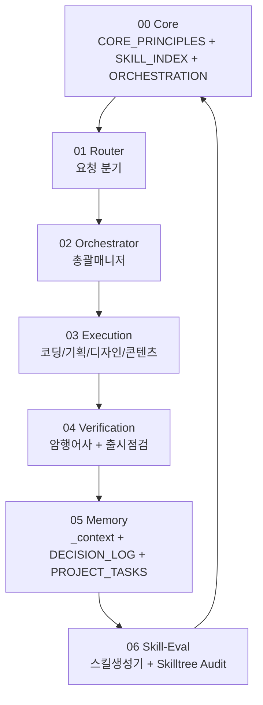

# 스킬 인덱스 (Skill Router) v2.0.10

> 새 AI 세션이 가장 먼저 읽어야 할 문서다.
> 이 문서는 단순 목록이 아니라 "요청 → 스킬 → 문서 → 검증"을 연결하는 라우터다.

---

## Canonical Root

현재 전역 스킬의 기준 원본은 GitHub repo의 `source/` 디렉터리다.
로컬 Antigravity, Codex, Claude Code 설치본은 모두 `source/`에서 생성되는 adapter 결과물이다.
설치본을 직접 고치지 않는다. 수정은 반드시 `source/`에 먼저 반영한 뒤 adapter를 다시 빌드한다.

**Mirror Sync Policy:**
- `source/`만 사람이 편집한다.
- `adapters/antigravity`, `adapters/codex`, `adapters/claude-code`는 생성물로 취급한다.
- adapter를 직접 고치지 않는다. drift가 발견되면 `source/`를 먼저 고친 뒤 `npm run build:adapters`를 실행한다.
- 로컬 설치본의 `CANONICAL_ROOT.md`는 이 GitHub repo와 `source/`를 가리키는 포인터다.

---

## System Layers



---

## Primary Router

| 사용자 의도 | 우선 스킬 | 보조 스킬 | 기준 문서 | 완료 기준 |
|-------------|-----------|-----------|-----------|-----------|
| 새 프로젝트 시작 | 오피스아워 | PRD생성, 디자인시스템 | `PROJECT_BRIEF.md` | GO/PIVOT/STOP 판정과 브리프 저장 |
| 요구사항 명세 | PRD생성 | 암행어사 | `PROJECT_BRIEF.md`, `PRD_*.md` | Out-of-Scope와 검증 가능한 인수 조건 |
| 디자인 기준 수립 | 디자인시스템 | 출시점검 | `PRD_*.md`, `DESIGN_SYSTEM.md` | 토큰, 접근성, 프리뷰 HTML |
| 현재 프로젝트 이어가기 | 총괄매니저 | 암행어사 | `GEMINI.md`, `_context.md`, `_order.md`, `DECISION_LOG.md` | 상태 브리핑, 기록, 다음 오더 |
| 실제 구현 | 코딩가이드 | 총괄매니저 | `_order.md`, `AGENTS.md`, 기존 코드 | 빌드/린트/완료 기준 보고 |
| 허점/리스크 찾기 | 암행어사 | 총괄매니저 | 코드와 문서 전체 | `_audit_YYYY-MM-DD.md` 저장 |
| 배포/품질 점검 | 출시점검 | 총괄매니저 | 코드 전체, 환경 설정 | `_launch_check.md`, GO/NO-GO |
| 스킬 생성/수정 | 스킬생성기 | 암행어사 | `CORE_PRINCIPLES.md`, `SKILL_INDEX.md` | 압박 시나리오 + 인덱스 동기화 |
| 스킬트리 자체 검증 | 암행어사 Skilltree Audit | 스킬생성기 | 전역 skills 폴더 | 충돌/버전/링크/비대화 보고서 |
| 블로그 전략 | 콘텐츠기획 | 블로그엔진 | `BRAND_CONTEXT.md`, `CONTENT_PLAN.md` | 키워드 맵과 발행 계획 |
| 블로그 글 작성 | 블로그엔진 | 인스타엔진 | `BRAND_CONTEXT.md`, `CONTENT_PLAN.md` | 본문, 제목, CTA, 품질 채점 |
| 인스타 운영 | 인스타엔진 | 콘텐츠기획, 암행어사 | 브랜드 문서, 인스타 운영 로그 | 목적 태그, 콘텐츠 패키지, 성과 루프 |
| 영상 제작 | HyperFrames | 디자인시스템 | STORYBOARD, `.agents/skills/hyperframes` | 승인된 스토리보드, lint, preview |

---

## Pipeline Skills

| 순서 | 스킬 | 버전 | 역할 | 입력 | 출력 |
|------|------|------|------|------|------|
| 1 | [오피스아워](오피스아워/SKILL.md) | v1.3.0 | 아이디어 검증 · 방향 설정 | 아이디어 (대화) | `PROJECT_BRIEF.md` |
| 2 | [PRD생성](PRD생성/SKILL.md) | v1.1.1 | 실행 가능한 요구사항 명세 | `PROJECT_BRIEF.md` | `PRD_v1.0.md` |
| 3 | [디자인시스템](디자인시스템/SKILL.md) | v2.3.0 | 디자인 토큰 · 스타일 규칙 · 안티-슬롭 · 프리뷰 | `PRD_v1.0.md` | `DESIGN_SYSTEM.md`, `DESIGN_PREVIEW.html` |
| 4 | [총괄매니저](총괄매니저/SKILL.md) | v2.16.0 | 작업 분배 · 판단 · 기록 · 장기 결정 관리 | `_context.md` | `_order.md`, `_playbook.md`, `_context.md`, `DECISION_LOG.md`, `CHECKLIST.md` |
| 5 | [코딩가이드](코딩가이드/SKILL.md) | v1.7.0 | 코딩 실행 계약 · 에스컬레이션 · 금지 패턴 · 검증 | `_order.md` | 코드 파일 + 작업 결과 또는 반려/부분완료 보고 |
| 6 | [출시점검](출시점검/SKILL.md) | v2.5.0 | 배포 품질 관문 · 런타임 스모크 테스트 | 코드 전체 | `_launch_check.md` |

---

## Verification Skills

| 스킬 | 버전 | 역할 | 주요 출력 |
|------|------|------|-----------|
| [암행어사](암행어사/SKILL.md) | v2.1.0 | 프로젝트/아이디어/전문가 렌즈/스킬트리 감사 | `_audit_YYYY-MM-DD.md`, `_skilltree_audit_YYYY-MM-DD.md` |
| [출시점검](출시점검/SKILL.md) | v2.5.0 | 배포 전 품질 점검과 GO/NO-GO | `_launch_check.md` |

---

## Utility and Domain Skills

| 스킬 | 버전 | 역할 | 입력 | 출력 |
|------|------|------|------|------|
| [스킬생성기](스킬생성기/SKILL.md) | v2.0.0 | 새 스킬 생성·수정·압박 테스트·인덱스 동기화 | 스킬 요구사항 | `SKILL.md`, `REFERENCES.md`, `CHECKLIST.md`, `SKILL_INDEX.md` 동기화 |
| [HyperFrames](HyperFrames/SKILL.md) | v2.0.0 | HTML 비디오 제작 PD 워크플로우 | 비디오 요구사항 | `.mp4`, `STORYBOARD.md`, `DESIGN.md`, `index.html` |
| [콘텐츠기획](콘텐츠기획/SKILL.md) | v1.1.0 | 브랜드 인터뷰 + 키워드 리서치 + 캘린더 | 대화/브랜드 정보 | `BRAND_CONTEXT.md`, `CONTENT_PLAN.md` |
| [블로그엔진](블로그엔진/SKILL.md) | v4.1.0 | 한국형 블로그 콘텐츠 퍼널 + 100점 채점 | 주제/키워드 | 완성 글 + 제목 5개 + 썸네일 카피 + 채점 + CHECKLIST |
| [인스타엔진](인스타엔진/SKILL.md) | v3.2.0 | 인스타 운영 OS · 숏폼·캐러셀·광고·DM·성과 루프 | 블로그 글/주제/데이터 | 모드별 분리 파일 패키지 + 브리프 + 성과 기록 |

---

## System Documents

| 문서 | 역할 |
|------|------|
| [CORE_PRINCIPLES.md](CORE_PRINCIPLES.md) | 최상위 원칙과 문서 우선순위 |
| [ORCHESTRATION.md](ORCHESTRATION.md) | 멀티모델 운영 순환도와 모델 티어 가이드 |

---

## Agent Adapter Rules

### Codex

- 프로젝트 루트에 `AGENTS.md`가 있으면 최우선으로 따른다.
- 코드 수정 전 현재 레포의 실제 파일과 패턴을 읽는다.
- Next.js 등 버전 민감 프레임워크는 `node_modules`의 현재 문서를 확인한다.
- 완료 선언 전 빌드, 린트, 테스트, 또는 실행 가능한 대체 검증을 수행한다.
- 전역 스킬을 수정할 때는 canonical root와 복제본 drift를 확인한다.

### Antigravity / Gemini

- 전역 스킬은 canonical root의 `SKILL_INDEX.md`를 먼저 읽는다.
- 프로젝트 작업은 `GEMINI.md`, `_context.md`, `_order.md`, `DECISION_LOG.md`를 기준으로 이어간다.
- 장기 결정은 채팅이 아니라 `DECISION_LOG.md`에 승격한다.
- 작업 결과는 다음 세션이 읽을 수 있게 파일에 남긴다.

### 공통

- 프롬프트보다 문서가 우선이다.
- 스킬보다 프로젝트 전용 지침이 우선이다.
- 검증 없는 완료 선언은 금지다.
- 스킬을 고친 뒤에는 스킬트리 감사 또는 최소한의 라우터 검증을 실행한다.

---

## Core Project Files

```text
프로젝트 루트/
├── AGENTS.md              # Codex/Claude 계열 프로젝트 지침
├── GEMINI.md              # Antigravity/Gemini 프로젝트 신분증
├── DECISION_LOG.md        # 장기 결정 로그 + 문서 우선순위
├── PROJECT_TASKS.md       # 전체 진행 조감도
├── PROJECT_BRIEF.md       # 오피스아워 출력
├── PRD_v1.0.md            # PRD생성 출력
├── DESIGN_SYSTEM.md       # 디자인시스템 출력
├── DESIGN_PREVIEW.html    # 디자인 프리뷰
├── _context.md            # 현재 상태, 30줄 이내
├── _order.md              # 현재 작업 지시서
├── _playbook.md           # Phase 단위 다건 지시서
├── _archive.md            # 압축된 과거 기록
├── _audit_YYYY-MM-DD.md   # 암행어사 보고서
└── _launch_check.md       # 출시점검 결과
```

---

## Skill Quality Gate

스킬을 생성하거나 수정한 뒤에는 아래를 확인한다.

```text
[ ] frontmatter version과 제목 버전이 일치한다.
[ ] description은 트리거 중심이며 본문 요약으로 과도하지 않다.
[ ] 최소 출력 기준이 있다.
[ ] Hard Fail 또는 금지사항이 있다.
[ ] 연결되는 다음 스킬이 명시되어 있다.
[ ] 참조 파일 경로가 실제 존재하거나 조건부임이 명시되어 있다.
[ ] 출력 규칙이 서로 충돌하지 않는다.
[ ] 400줄 초과 시 REFERENCES/CHECKLIST 분리 검토가 기록되어 있다.
[ ] SKILL_INDEX의 버전과 역할 설명이 동기화되어 있다.
```

---

## 상위 규칙

모든 스킬은 [CORE_PRINCIPLES.md](CORE_PRINCIPLES.md)의 원칙에 종속된다.

---

## 변경 이력

| 버전 | 날짜 | 변경 내용 |
|------|------|----------|
| v2.0.10 | 2026-05-29 | 암행어사 v2.1.0 반영: 모드 라우터 중심 진입점, 상세 감찰 절차 REFERENCES 분리, 최종 CHECKLIST 재정리 |
| v2.0.9 | 2026-05-29 | 코딩가이드 v1.7.0 반영: 능력 보존형 슬림화, CHECKLIST 추가, 상세 규칙 REFERENCES 분리 |
| v2.0.8 | 2026-05-29 | 총괄매니저 v2.16.0 반영: `_order.md`/`_playbook.md` overwrite-slot 운영 규칙 동기화 |
| v2.0.7 | 2026-05-26 | 총괄매니저 v2.15.0, 코딩가이드 v1.6.0 에스컬레이션 프로토콜, ORCHESTRATION.md 멀티모델 문서 반영 |
| v2.0.6 | 2026-05-26 | 블로그엔진 v4.1.0 반영: SKILL/REFERENCES/CHECKLIST 구조로 분리 |
| v2.0.5 | 2026-05-26 | 총괄매니저 v2.14.0 반영: SKILL.md 400줄 이하 축소 |
| v2.0.4 | 2026-05-26 | 총괄매니저 v2.13.0 반영: 2차 슬림화로 SKILL.md 실행면 축소 |
| v2.0.3 | 2026-05-26 | 총괄매니저 v2.12.0 반영: 대형 스킬을 SKILL/REFERENCES/CHECKLIST 구조로 분리 |
| v2.0.2 | 2026-05-26 | Duplicate tree mirror sync policy 추가: 로컬 Antigravity 복제본은 canonical root의 mirror로 고정 |
| v2.0.1 | 2026-05-26 | 인스타엔진 v3.2.0 반영: `shortform_package.md` 통합 1파일 대신 모드별 분리 파일 패키지를 canonical output으로 동기화 |
| v2.0.0 | 2026-05-26 | Project Brain Skilltree v2: Skill Router, Canonical Root, System Layers, Agent Adapter Rules, Skill Quality Gate 추가. 실제 스킬 버전 동기화 |
| v1.5.4 | 2026-05-20 | 프로젝트 위생 정리 파이프라인(Project Hygiene Pipeline) 이식: 암행어사 v1.5.0, 총괄매니저 v2.11.0, 코딩가이드 v1.5.0 |
| v1.5.3 | 2026-05-20 | Superpowers 기능 벤치마킹 반영: 난이도별 디버깅 분기, 조건부 TDD, 디버깅 4단계 프로토콜 |
| v1.5.2 | 2026-05-14 | 스킬 최소 출력 기준, 운영 로그 우선, SKILL/REFERENCES/CHECKLIST 분리 원칙 |
| v1.5.1 | 2026-05-14 | DECISION_LOG.md 자동 생성/관리, 문서 우선순위 내장 |
| v1.5.0 | 2026-05-11 | taste-skill/output-skill 내재화 |
| v1.4.0 | 2026-05-07 | 콘텐츠기획 추가 + 블로그 파이프라인 흐름도 추가 |
| v1.3.0 | 2026-05-07 | 블로그엔진 v3.0.0 추가 |
| v1.2.0 | 2026-04-24 | HyperFrames 래퍼 스킬 추가 |
| v1.1.0 | 2026-04-22 | 디자인시스템 프리뷰 HTML, GEMINI.md + PROJECT_TASKS.md 반영 |
| v1.0.0 | 2026-04-20 | 최초 생성 |
