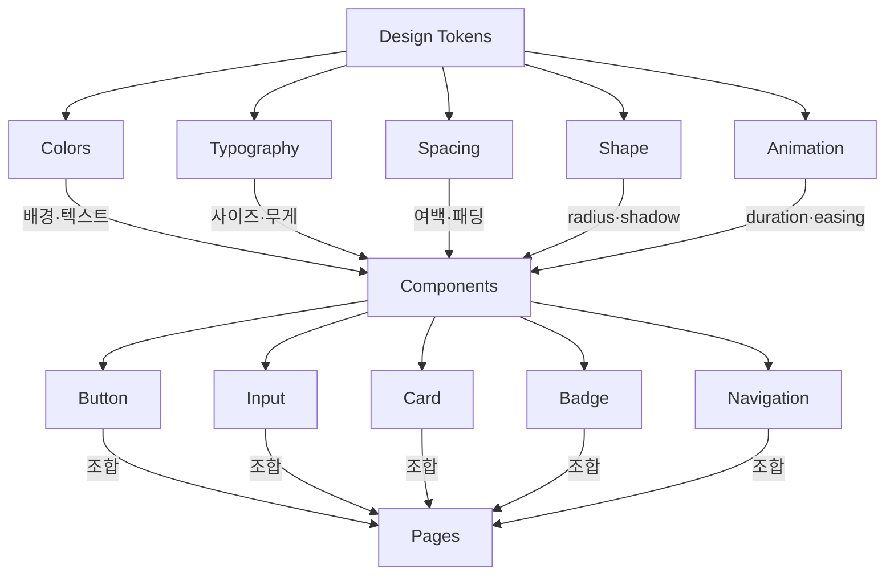

# SUPREME DESIGN SYSTEM TEMPLATE (표준 출력 포맷)

> 이 파일은 `디자인시스템` 스킬이 DESIGN_SYSTEM.md를 생성할 때 사용하는 표준 템플릿이다.
> Phase 4에서 이 파일을 읽고, 플레이스홀더를 실제 값으로 채워서 출력한다.

```markdown
---
document_type: "Design System"
version: "1.0.0"
last_updated: "YYYY-MM-DD"
source_prd: "[PRD 파일명 또는 null]"
platform: "[mobile-first | desktop-first | responsive]"
dark_mode: [true | false]
tech_stack: "[tailwind | css-variables | styled-components | shadcn]"
icon_library: "[lucide | heroicons | phosphor]"
llm_directives:
  strict_mode: true
  color_hardcoding: "NEVER use hardcoded hex values. ALWAYS use design tokens."
  spacing_rule: "ALL spacing must be multiples of 4px grid."
  accessibility: "ALL text-background combinations must pass WCAG AA (4.5:1)."
---

# [프로젝트명] — Design System

> Version: 1.0.0 | Date: [날짜] | Platform: [플랫폼] | Stack: [기술 스택]

---

## 0. 디자인 방향 (Design Direction)

**무드/톤:** [한 줄 표현]
**레퍼런스:** [앱/서비스명 또는 "자체 설계"]
**금지 사항:** [절대 쓰면 안 되는 스타일]

### 디자인 원칙 (3가지)
1. **[원칙1 이름]:** [한 줄 설명]
2. **[원칙2 이름]:** [한 줄 설명]
3. **[원칙3 이름]:** [한 줄 설명]

---

## 1. 컬러 시스템

### 1.1 라이트 모드 팔레트

| 토큰 | 헥스 | 용도 | 대비비 |
|------|------|------|--------|
| `--color-primary` | #?????? | 브랜드 메인, CTA | — |
| `--color-primary-hover` | #?????? | Primary 호버 | — |
| `--color-primary-foreground` | #FFFFFF | Primary 위 텍스트 | ?:1 ✅ |
| `--color-secondary` | #?????? | 보조 액션 | — |
| `--color-accent` | #?????? | 강조, 뱃지, 알림 | — |
| `--color-bg` | #?????? | 전체 배경 | — |
| `--color-surface` | #?????? | 카드, 패널 배경 | — |
| `--color-text` | #?????? | 기본 텍스트 | ?:1 ✅ |
| `--color-text-sub` | #?????? | 보조 텍스트 | ?:1 ✅ |
| `--color-text-muted` | #?????? | 비활성 텍스트 | ?:1 ⚠️ |
| `--color-border` | #?????? | 구분선, 테두리 | — |
| `--color-ring` | #?????? | 포커스 링 | — |
| `--color-error` | #EF4444 | 에러, 삭제 | — |
| `--color-success` | #22C55E | 성공, 완료 | — |
| `--color-warning` | #F59E0B | 경고, 주의 | — |
| `--color-info` | #3B82F6 | 정보, 안내 | — |

### 1.2 다크 모드 팔레트

| 토큰 | 라이트 | 다크 |
|------|--------|------|
| `--color-bg` | #?????? | #?????? |
| `--color-surface` | #?????? | #?????? |
| `--color-text` | #?????? | #?????? |
| `--color-text-sub` | #?????? | #?????? |
| `--color-border` | #?????? | #?????? |
| `--color-ring` | #?????? | #?????? |

### 1.3 CSS 변수 선언

```css
:root {
  /* === Brand === */
  --color-primary:            #??????;
  --color-primary-hover:      #??????;
  --color-primary-foreground:  #FFFFFF;
  --color-secondary:          #??????;
  --color-accent:             #??????;

  /* === Surface === */
  --color-bg:       #??????;
  --color-surface:  #??????;
  --color-border:   #??????;
  --color-ring:     #??????;

  /* === Text === */
  --color-text:       #??????;
  --color-text-sub:   #??????;
  --color-text-muted: #??????;

  /* === Semantic === */
  --color-error:   #EF4444;
  --color-success: #22C55E;
  --color-warning: #F59E0B;
  --color-info:    #3B82F6;
}

[data-theme="dark"],
.dark {
  --color-bg:         #??????;
  --color-surface:    #??????;
  --color-border:     #??????;
  --color-ring:       #??????;
  --color-text:       #??????;
  --color-text-sub:   #??????;
  --color-text-muted: #??????;
}
```

---

## 2. 타이포그래피

### 2.1 폰트 패밀리

| 용도 | 폰트 | Fallback | 로드 |
|------|------|----------|------|
| Display (제목) | [폰트명] | sans-serif | Google Fonts |
| Body (본문/UI) | [폰트명] | sans-serif | Google Fonts |
| Mono (코드) | [폰트명] | monospace | Google Fonts |

### 2.2 Google Fonts 임포트
```css
@import url('https://fonts.googleapis.com/css2?family=[폰트]&display=swap');
```

### 2.3 타이포그래피 스케일 & 사용 규칙

```css
:root {
  --font-display: '[Display]', sans-serif;
  --font-body:    '[Body]', sans-serif;
  --font-mono:    '[Mono]', monospace;

  --text-xs:   0.6875rem;  /* 11px */
  --text-sm:   0.8125rem;  /* 13px */
  --text-base: 0.9375rem;  /* 15px */
  --text-lg:   1.125rem;   /* 18px */
  --text-xl:   1.375rem;   /* 22px */
  --text-2xl:  1.75rem;    /* 28px */
  --text-3xl:  2.25rem;    /* 36px */

  --leading-tight:   1.2;
  --leading-snug:    1.4;
  --leading-normal:  1.5;
  --leading-relaxed: 1.65;

  --font-regular:  400;
  --font-medium:   500;
  --font-semibold: 600;
  --font-bold:     700;
}
```

| 역할 | 사이즈 | 무게 | 폰트 | Line Height |
|------|--------|------|------|-------------|
| 페이지 제목 (H1) | `--text-3xl` | `--font-bold` | Display | tight |
| 섹션 제목 (H2) | `--text-xl` | `--font-semibold` | Display | snug |
| 카드 제목 | `--text-lg` | `--font-semibold` | Body | snug |
| 본문 | `--text-base` | `--font-regular` | Body | relaxed |
| 라벨/캡션 | `--text-sm` | `--font-medium` | Body | normal |
| 마이크로 | `--text-xs` | `--font-regular` | Body | normal |

---

## 3. 간격 시스템 (4px 베이스 그리드)

```css
:root {
  --space-0:  0px;
  --space-1:  4px;    /* 0.25rem */
  --space-2:  8px;    /* 0.5rem  */
  --space-3:  12px;   /* 0.75rem */
  --space-4:  16px;   /* 1rem    */
  --space-5:  20px;   /* 1.25rem */
  --space-6:  24px;   /* 1.5rem  */
  --space-8:  32px;   /* 2rem    */
  --space-10: 40px;   /* 2.5rem  */
  --space-12: 48px;   /* 3rem    */
  --space-16: 64px;   /* 4rem    */
  --space-20: 80px;   /* 5rem    */
}
```

### 사용 규칙

| 상황 | 토큰 |
|------|------|
| 아이콘 ↔ 텍스트 | `--space-2` (8px) |
| 컴포넌트 내부 패딩 | `--space-3` ~ `--space-4` |
| 카드 패딩 | `--space-4` ~ `--space-5` |
| 리스트 아이템 간격 | `--space-3` |
| 섹션 간 간격 | `--space-8` ~ `--space-12` |
| 페이지 좌우 여백 | `--space-4` (모바일) / `--space-8` (데스크탑) |

> ⛔ **절대 규칙:** 모든 간격은 4px 배수여야 한다. 5px, 7px, 13px 같은 값은 사용하지 않는다.

---

## 4. 형태 시스템 (Shape & Shadow)

```css
:root {
  /* === Border Radius === */
  --radius-sm:   4px;     /* 태그, 뱃지 */
  --radius-md:   8px;     /* 버튼, 인풋 */
  --radius-lg:   12px;    /* 카드 */
  --radius-xl:   16px;    /* 모달, 바텀시트 */
  --radius-2xl:  24px;    /* 큰 패널 */
  --radius-full: 9999px;  /* 아바타, 필 버튼 */

  /* === Shadow === */
  --shadow-sm:  0 1px 3px rgba(0,0,0,0.08);
  --shadow-md:  0 4px 12px rgba(0,0,0,0.10);
  --shadow-lg:  0 8px 24px rgba(0,0,0,0.12);
  --shadow-xl:  0 16px 48px rgba(0,0,0,0.16);
}
```

| 요소 | Radius | Shadow |
|------|--------|--------|
| 태그/뱃지 | `--radius-sm` | 없음 |
| 버튼/인풋 | `--radius-md` | 없음 |
| 카드 | `--radius-lg` | `--shadow-sm` |
| 드롭다운/팝업 | `--radius-lg` | `--shadow-md` |
| 모달/바텀시트 | `--radius-xl` | `--shadow-lg` |
| 아바타/FAB | `--radius-full` | `--shadow-sm` |

---

## 5. 애니메이션 & 트랜지션

```css
:root {
  /* === Duration === */
  --duration-fast:   150ms;
  --duration-normal: 250ms;
  --duration-slow:   400ms;

  /* === Easing === */
  --ease-default:    cubic-bezier(0.4, 0, 0.2, 1);
  --ease-in:         cubic-bezier(0.4, 0, 1, 1);
  --ease-out:        cubic-bezier(0, 0, 0.2, 1);
  --ease-bounce:     cubic-bezier(0.68, -0.55, 0.265, 1.55);

  /* === Composed === */
  --transition-fast:   var(--duration-fast) var(--ease-default);
  --transition-normal: var(--duration-normal) var(--ease-default);
  --transition-slow:   var(--duration-slow) var(--ease-out);
}
```

### 사용 규칙

| 상황 | 트랜지션 | 속성 |
|------|---------|------|
| 버튼 호버/프레스 | `--transition-fast` | background-color, transform |
| 카드 호버 | `--transition-normal` | box-shadow, transform |
| 모달 열기/닫기 | `--transition-slow` | opacity, transform |
| 색상 토글 (다크모드) | `--transition-normal` | color, background-color |
| 포커스 링 | `--transition-fast` | box-shadow |

### 인터랙션 피드백

```css
/* 버튼 프레스 효과 */
.btn:active { transform: scale(0.97); }

/* 카드 호버 */
.card:hover { transform: translateY(-2px); box-shadow: var(--shadow-md); }

/* 링크 호버 */
a:hover { opacity: 0.8; }
```

> ⛔ **절대 규칙:** `animation-duration: 0` 또는 `prefers-reduced-motion`을 반드시 지원한다.
```css
@media (prefers-reduced-motion: reduce) {
  *, *::before, *::after {
    animation-duration: 0.01ms !important;
    transition-duration: 0.01ms !important;
  }
}
```

---

## 6. 반응형 브레이크포인트

```css
:root {
  --breakpoint-sm:  640px;   /* 모바일 (소) */
  --breakpoint-md:  768px;   /* 태블릿 */
  --breakpoint-lg:  1024px;  /* 데스크탑 */
  --breakpoint-xl:  1280px;  /* 와이드 데스크탑 */
}
```

### 레이아웃 규칙

| 플랫폼 | 최대 너비 | 좌우 여백 | 특이사항 |
|--------|----------|----------|---------|
| 모바일 (< 640px) | 100% | 16px | 앱바 56px, 하단 내비 60px |
| 태블릿 (640~1023px) | 100% | 24px | 사이드바 선택적 |
| 데스크탑 (1024~1279px) | 1024px | 32px | 사이드바 240px 고정 |
| 와이드 (≥ 1280px) | 1200px | auto | 중앙 정렬 |

---

## 7. 아이콘 시스템

**라이브러리:** [Lucide React / Heroicons / Phosphor Icons]
**선정 이유:** [한 줄]

### 사이즈 규칙

| 용도 | 사이즈 | 예시 |
|------|--------|------|
| 인라인 (텍스트 옆) | 16px | 화살표, 외부 링크 |
| 버튼 내부 | 20px | 추가, 편집 버튼 |
| 내비게이션 | 24px | 탭바, 사이드 메뉴 |
| 빈 상태/일러스트 | 32~48px | "데이터 없음" 화면 |

> 아이콘 컬러는 항상 `currentColor`를 사용하여 부모의 텍스트 색상을 상속한다.

---

## 8. 컴포넌트 규칙

### 버튼
| 타입 | 배경 | 텍스트 | 용도 |
|------|------|--------|------|
| Primary | `--color-primary` | `--color-primary-foreground` | 핵심 CTA (화면 당 1개) |
| Secondary | `--color-surface` | `--color-text` | 보조 액션 |
| Ghost | transparent | `--color-text-sub` | 취소, 닫기 |
| Danger | `--color-error` | white | 삭제, 위험 액션 |
| Outline | transparent + border | `--color-primary` | 덜 강조 액션 |

- 높이: **44px** (모바일 탭 타겟) / **36px** (데스크탑 compact)
- 좌우 패딩: `--space-4`
- 폰트: `--text-sm`, `--font-semibold`
- Radius: `--radius-md`
- 트랜지션: `--transition-fast`
- Disabled: `opacity: 0.5; cursor: not-allowed;`

### 인풋 필드
- 높이: **48px** (모바일) / **40px** (데스크탑)
- 테두리: `1px solid var(--color-border)`
- 포커스: `2px solid var(--color-ring)` + `box-shadow: 0 0 0 3px color-mix(in srgb, var(--color-primary) 20%, transparent)`
- 배경: `var(--color-surface)`
- Radius: `--radius-md`
- 플레이스홀더: `var(--color-text-muted)`
- Error 상태: 테두리 `var(--color-error)`

### 카드
- 배경: `var(--color-surface)`
- 테두리: `1px solid var(--color-border)` (또는 `--shadow-sm`으로 대체)
- Radius: `--radius-lg`
- 내부 패딩: `--space-4` ~ `--space-5`

### 상태 표시 (Status Badge)

| 상태 | 컬러 토큰 | 용법 |
|------|----------|------|
| 성공/완료 | `--color-success` | 초록 뱃지, 체크 아이콘 |
| 진행중 | `--color-primary` | 파란 뱃지, 스피너 |
| 경고 | `--color-warning` | 노란 뱃지 |
| 에러/실패 | `--color-error` | 빨간 뱃지, 에러 메시지 |
| 비활성/대기 | `--color-text-muted` | 흐린 텍스트, disabled |

---

## 9. 접근성 기준 (a11y)

### 대비비 규칙 (WCAG AA)
- **일반 텍스트** (< 18px): 최소 대비비 **4.5:1**
- **대형 텍스트** (≥ 18px bold 또는 ≥ 24px): 최소 대비비 **3:1**
- **UI 컨트롤** (버튼,인풋 테두리): 최소 대비비 **3:1**

### 포커스 표시
```css
:focus-visible {
  outline: 2px solid var(--color-ring);
  outline-offset: 2px;
}
```

### 터치 타겟
- 모든 인터랙티브 요소: 최소 **44 × 44px** 터치 영역
- 인접 터치 요소 간격: 최소 **8px**

### 모션 접근성
- `prefers-reduced-motion: reduce` 미디어 쿼리 필수 지원
- 자동 재생 애니메이션 금지 (사용자 트리거만 허용)

---

## 10. 명시적 Out-of-Scope (이 디자인 시스템이 다루지 않는 것)

> ⛔ 아래 항목은 v1.0에서 의도적으로 제외한다. 에이전트는 구현하지 않는다.

- **[DS-X001]** 3D 효과 / WebGL 기반 비주얼
- **[DS-X002]** 복잡한 SVG 일러스트레이션 가이드라인
- **[DS-X003]** 비디오/오디오 플레이어 커스텀 스킨
- **[DS-X004]** 이메일 템플릿 전용 스타일
- **[DS-X005]** 인쇄(Print) 전용 스타일
- **[DS-X006]** [프로젝트 특성상 제외할 것들]

---

## 11. 토큰 의존성 구조



---

## 12. AI Evals & 품질 관문

> 에이전트가 UI 코드를 커밋하기 전 반드시 통과해야 하는 검증 기준

- [ ] **DS-EVAL-01:** 모든 컬러가 CSS 변수/토큰으로 사용되고, 하드코딩된 헥스값이 없는가?
- [ ] **DS-EVAL-02:** 텍스트-배경 대비비가 WCAG AA(4.5:1) 이상인가?
- [ ] **DS-EVAL-03:** 모든 간격이 4px 배수(--space-N 토큰)에서 벗어나지 않는가?
- [ ] **DS-EVAL-04:** 버튼/인풋 터치 타겟이 44px 이상인가?
- [ ] **DS-EVAL-05:** 다크모드 전환 시 모든 토큰이 정상 반영되는가?
- [ ] **DS-EVAL-06:** `prefers-reduced-motion` 대응이 되어 있는가?
- [ ] **DS-EVAL-07:** 포커스 링(:focus-visible)이 모든 인터랙티브 요소에 적용되었는가?
- [ ] **DS-EVAL-08:** 폰트가 정상 로드되고, 폴백 폰트가 작동하는가?

---

## 13. AI 코딩 세션용 컨텍스트 블록

> 바이브코딩 세션 시작 시 이 블록을 붙여넣으세요.

```
[프로젝트명] 디자인 시스템 v1.0:

무드: [한 줄 무드]
플랫폼: [모바일 우선/데스크탑/양쪽]

컬러:
- Primary: #?????? / Hover: #??????
- BG: #?????? (다크: #??????)
- Surface: #?????? (다크: #??????)
- Text: #?????? (다크: #??????)
- Border: #??????
- Error: #EF4444 / Success: #22C55E / Warning: #F59E0B

폰트: [Display] + [Body] (Google Fonts)
아이콘: [Lucide/Heroicons] — 16/20/24/32px

핵심 규칙:
- 버튼 radius: 8px, 높이: 44px(모바일)/36px(데스크탑)
- 카드 radius: 12px, 패딩: 16~20px
- 간격: 4px 배수만 사용
- 컬러 하드코딩 금지 — 반드시 CSS 변수 사용
- 텍스트 대비비 WCAG AA(4.5:1) 필수
- hover: 150ms ease / 모달: 400ms ease-out
- 금지: [금지 사항]

이 규칙을 모든 컴포넌트에 일관되게 적용해줘.
```

---

## 14. 변경 이력

| 버전 | 날짜 | 변경 내용 |
|------|------|----------|
| 1.0.0 | [날짜] | 최초 작성 |
```

---

## 15. 안티-슬롭 규칙 (UI 감각 가이드)

> AI가 생성하는 Generic한 UI를 방지하기 위한 디자인 감각 규칙.
> 코딩 시 이 섹션을 반드시 참조하여 "AI스러운" 평범한 결과물을 막는다.

### 15.1 감각 다이얼 (프로젝트별 설정)

| 다이얼 | 값 (1~10) | 설명 |
|--------|----------|------|
| **DESIGN_VARIANCE** | [?] | 레이아웃 실험도 (1=대칭·깔끔 / 10=비대칭·모던) |
| **MOTION_INTENSITY** | [?] | 애니메이션 깊이 (1=호버만 / 10=스크롤·물리) |
| **VISUAL_DENSITY** | [?] | 뷰포트당 정보량 (1=여유 갤러리 / 10=대시보드) |

> 💡 **기준:** CRM/대시보드 → DENSITY 높게(7~8). 포트폴리오/갤러리 → VARIANCE 높게(6~7). 일반 앱 → 중간(4~6).

### 15.2 레이아웃 금지 패턴

| # | 금지 패턴 | 대안 |
|---|----------|------|
| 1 | **3열 균등 카드 레이아웃** | 2열 지그재그, 비대칭 그리드, 수평 스크롤 |
| 2 | **중앙 정렬 히어로** (VARIANCE > 4일 때) | 좌정렬+우측 에셋, 분할 화면, 비대칭 여백 |
| 3 | **카드 안에 카드** | 여백·구분선으로 계층 표현 |
| 4 | **네온/외부 글로우** | 내부 보더 또는 틴트된 그림자 |
| 5 | **순수 검정(#000000)** 배경·텍스트 | Off-Black, Zinc-950, 차콜 사용 |
| 6 | **과채도 액센트 남발** | 중성 베이스 + 고대비 단일 액센트 |

### 15.3 필수 UI 상태

> ⚠️ AI는 "성공 상태"만 생성하는 편향이 있다. 아래 4가지 상태를 반드시 구현한다.

| 상태 | 필수 구현 | 금지 |
|------|----------|------|
| **Loading** | 레이아웃 크기에 맞는 스켈레톤 | 원형 스피너 단독 사용 |
| **Empty** | 안내 문구 + 행동 유도(CTA) | 빈 화면 방치 |
| **Error** | 인라인 에러 메시지 + 재시도 | alert() 사용 |
| **Active/Hover** | 눌림감(`scale(0.97)` 또는 `translateY(-1px)`) | 정적 버튼 |

### 15.4 성능 규칙

- ✅ 애니메이션은 `transform`과 `opacity`만 사용
- ✅ `will-change`는 꼭 필요한 요소에만, 해제도 함께
- ❌ `top`, `left`, `width`, `height` 애니메이션 금지
- ❌ 스크롤 컨테이너에 grain/noise 필터 금지 (GPU 리페인트)
- ❌ 무분별한 `z-index` 남발 금지 (시스템 레이어만 사용)

### 15.5 콘텐츠 품질

| 금지 | 대안 |
|------|------|
| 이름: "John Doe", "홍길동" | 맥락에 맞는 자연스러운 이름 |
| 숫자: `99.99%`, `1234567` | 유기적 수치 (`47.2%`, `010-8847-1928`) |
| 카피: "혁신적인", "시너지", "차세대" | 구체적 동사와 사실 기반 표현 |
| 이미지: 깨진 Unsplash 링크 | `picsum.photos/seed/{랜덤}/800/600` 또는 SVG |

### 15.6 AI Evals (안티-슬롭)

- [ ] **AS-EVAL-01:** 3열 균등 카드 레이아웃이 없는가?
- [ ] **AS-EVAL-02:** Loading/Empty/Error 상태가 모두 구현되었는가?
- [ ] **AS-EVAL-03:** 순수 검정(#000000)이 사용되지 않았는가?
- [ ] **AS-EVAL-04:** 애니메이션이 transform/opacity로만 구현되었는가?
- [ ] **AS-EVAL-05:** 더미 데이터가 자연스럽고 맥락에 맞는가?

---

## 스택별 추가 출력 블록

스캔 결과에 따라 아래 블록을 **추가로** 출력한다.

### Tailwind 감지 시 → `tailwind.config.ts` extend 코드 추가

```typescript
// tailwind.config.ts — extend 블록 (디자인 시스템 적용)
const config = {
  theme: {
    extend: {
      colors: {
        primary: { DEFAULT: '#??????', hover: '#??????', foreground: '#??????' },
        secondary: '#??????',
        accent: '#??????',
        background: '#??????',
        surface: '#??????',
        border: '#??????',
        ring: '#??????',
        error: '#EF4444',
        success: '#22C55E',
        warning: '#F59E0B',
      },
      fontFamily: {
        display: ['[Display폰트]', 'sans-serif'],
        body: ['[Body폰트]', 'sans-serif'],
      },
      borderRadius: {
        sm: '4px', md: '8px', lg: '12px', xl: '16px', '2xl': '24px',
      },
      spacing: {
        /* 4px 그리드 기반 — Tailwind 기본과 동일 */
      },
      transitionDuration: {
        fast: '150ms', normal: '250ms', slow: '400ms',
      },
    },
  },
};
```

### styled-components 감지 시 → `theme.ts` 객체 추가

```typescript
// theme.ts — ThemeProvider용 테마 객체
export const theme = {
  colors: {
    primary: '#??????',
    primaryHover: '#??????',
    secondary: '#??????',
    accent: '#??????',
    bg: '#??????',
    surface: '#??????',
    text: '#??????',
    textSub: '#??????',
    border: '#??????',
    error: '#EF4444',
    success: '#22C55E',
    warning: '#F59E0B',
  },
  fonts: {
    display: "'[Display]', sans-serif",
    body: "'[Body]', sans-serif",
  },
  radii: { sm: '4px', md: '8px', lg: '12px', xl: '16px', full: '9999px' },
  space: [0, 4, 8, 12, 16, 20, 24, 32, 40, 48, 64, 80],
  transitions: {
    fast: '150ms ease', normal: '250ms ease', slow: '400ms ease-out',
  },
} as const;
```
